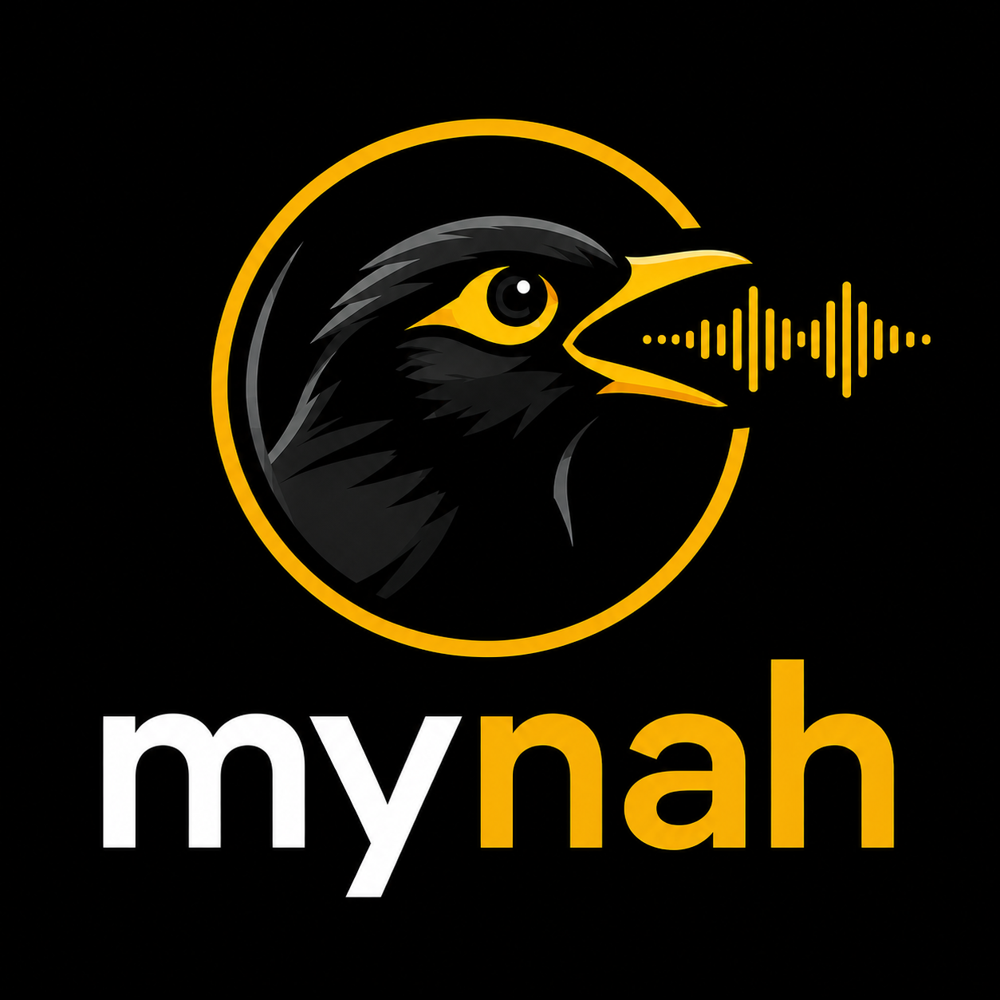

<p align="center">
  
</p>

# Mynah ASR

[](https://github.com/gabriele-mastrapasqua/mynah/actions/workflows/ci.yml)
[](https://github.com/gabriele-mastrapasqua/mynah/actions/workflows/codeql.yml)
[](https://github.com/gabriele-mastrapasqua/mynah/actions/workflows/safety.yml)
[](docs/models.md)
[](docs/nemotron-languages.md)
[](LICENSE)

**A fast native C inference engine for speech recognition & translation** —
llama.cpp-style: streaming and offline, CPU/Metal/CUDA, no Python at runtime.

Today it runs the best open speech models (Parakeet, Canary, Nemotron); the
engine layer is model-agnostic and built to host more families tomorrow.

```
$ mynah transcribe -m models/parakeet-tdt-0.6b-v3 -i audio.wav --timestamps
[5.2s audio | load 0.04s | inference 0.48s | RTF 0.092 | lang=auto]
  0.00   0.56  Ciao,
  0.64   0.72  questo
  ...

$ mynah transcribe -m models/canary-1b-v2 -i italian.wav --lang it --target-lang en
The satellite, in space, receives the signal and then sends it back almost instantly.

$ rec -q -t raw -r 16000 -e signed -b 16 -c 1 - | mynah stream -m models/nemotron-3.5-...
(live cache-aware transcription, selectable 80 ms – 1.12 s latency)
```

## What it is

Mynah is not "another speech recognizer": it is a **native runtime for modern ASR
models**, in the spirit of `llama.cpp` / `whisper.cpp`. One shared FastConformer
encoder, interchangeable decoders behind a vtable (`engine.h`), streaming as a
first-class citizen.

- **Pure C11**, zero runtime dependencies (only BLAS: Accelerate/OpenBLAS)
- **10 models across 4 decoder families** — RNNT, TDT, CTC and AED (Canary)
- **Speech translation**: Canary translates speech (25 EU languages ↔ English
  with canary-1b-v2, en↔de/es/fr with the flash models) — CLI `--target-lang`,
  server `/v1/audio/translations`
- **CPU-first** — warm offline RTF 0.015–0.06 on Apple Silicon (long audio);
  optional **Metal** backend (−25…45%) and CUDA (pending validation); int8/int4
  with native SDOT/VNNI kernels
- **Cache-aware streaming** (Nemotron): runtime-selectable 80 ms–1.12 s latency,
  emitted text is never retracted, **byte-identical to the offline path**
- **40 languages** with language detection (Nemotron), 25 EU languages with
  PnC+ITN (Parakeet v3, canary-1b-v2)
- **Per-word timestamps**, automatic silence-based segmentation of long files
  (model-aware), weight-stationary batching, OpenAI-compatible REST + WebSocket
  server
- **Two weight containers**: safetensors (default, zero-copy mmap) or **GGUF**
  (F32/F16/BF16/Q8_0/Q4_0, `tools/export_gguf.py`) — same code path after load
- **Python bindings** (ctypes, zero dependencies) on top of `libmynah`
- Quality measured on **real audio**: CER 0.00–0.07 across 11 languages
  ([hear it below](#hear-it--11-languages-one-sentence)), translations scored
  against parallel references — `make test-samples`
- Python only as offline tooling (weight conversion, reference oracle, eval)

## Supported models

**v0.4-dev, feature-complete toward v1** — 10 working models
(full catalog with verified configs: [docs/models.md](docs/models.md)):

| Model | What it does | Status |
|---|---|---|
| [nemotron-3.5-asr-streaming-0.6b](https://huggingface.co/nvidia/nemotron-3.5-asr-streaming-0.6b) | **streaming** cache-aware + offline, 40 languages, LID | ✅ |
| [parakeet-tdt-0.6b-v3](https://huggingface.co/nvidia/parakeet-tdt-0.6b-v3) | offline TDT, 25 EU languages, PnC+ITN | ✅ |
| [parakeet-tdt_ctc-110m](https://huggingface.co/nvidia/parakeet-tdt_ctc-110m) | TDT+CTC 114M EN — the fastest | ✅ |
| [parakeet-rnnt-0.6b](https://huggingface.co/nvidia/parakeet-rnnt-0.6b) / [ctc-0.6b](https://huggingface.co/nvidia/parakeet-ctc-0.6b) | offline EN | ✅ |
| [parakeet-rnnt-1.1b](https://huggingface.co/nvidia/parakeet-rnnt-1.1b) / [ctc-1.1b](https://huggingface.co/nvidia/parakeet-ctc-1.1b) | offline EN, 42 layers | ✅ |
| [canary-180m-flash](https://huggingface.co/nvidia/canary-180m-flash) / [1b-flash](https://huggingface.co/nvidia/canary-1b-flash) | ASR en/de/es/fr + **translation** + word timestamps | ✅ |
| [canary-1b-v2](https://huggingface.co/nvidia/canary-1b-v2) | ASR in **25 EU languages** + en↔24 translation, ITN | ✅ |

## Performance — CPU vs Metal vs int8

RTF on Apple Silicon, ~65 s audio, warm; **lower is faster** (0.05 ≈ 20× faster
than realtime). Full matrix and methodology in
[docs/benchmarks.md](docs/benchmarks.md).

| model | f32 CPU | Metal | int8 |
|---|---|---|---|
| parakeet-tdt_ctc-110m | 0.015 | **0.010** | 0.015 |
| canary-180m-flash (AED, +translation) | 0.060 | 0.054 | **0.030** |
| parakeet-tdt-0.6b-v3 | 0.047 | **0.030** | 0.046 |
| nemotron-3.5-asr-streaming-0.6b | 0.055 | **0.040** | 0.054 |
| parakeet-rnnt/ctc-0.6b | 0.05/0.04 | 0.028/0.022 | ≈f32 |
| parakeet-rnnt/ctc-1.1b | 0.07/0.06 | 0.041/0.033 | ≈f32 |
| canary-1b-flash (AED, +translation) | 0.143 | **0.081** | ~0.07 |

RAM: 110m 0.44 GB · 180m 0.71 · 0.6B ~2.4 · 1b-flash 3.3 · 1.1b 4.0 GB
(int8: ~⅓). Nemotron streaming: ~26 ms of compute per 80 ms chunk (9 ms int4).

Every numeric stage is validated against a numpy reference oracle
(`make test`: bit-exact mel, f32-tolerance encoder, streaming ≡ offline).

## Hear it — 11 languages, one sentence

The quality suite runs on **real committed audio** ([samples/](samples/README.md)):
parallel [FLEURS](https://huggingface.co/datasets/google/fleurs) clips (CC-BY 4.0),
the *same sentence* read by native speakers in 11 languages. Click a clip to
listen; the text is the reference transcription — mynah's output matches it
with **CER 0.00–0.07** (`make test-samples`).

| | clip | reference transcription |
|---|---|---|
| 🇮🇹 it | [▶ fleurs_1521](samples/it/fleurs_1521.wav) | Il satellite nello spazio riceve il segnale e poi lo rimanda indietro quasi all'istante. |
| 🇺🇸 en | [▶ fleurs_1521](samples/en/fleurs_1521.wav) | The satellite in space gets the call and then reflects it back down, almost instantly. |
| 🇩🇪 de | [▶ fleurs_1521](samples/de/fleurs_1521.wav) | Der Satellit im Weltraum empfängt den Anruf und reflektiert ihn dann fast sofort zurück nach unten. |
| 🇪🇸 es | [▶ fleurs_1521](samples/es/fleurs_1521.wav) | El satélite en el espacio recibe la llamada y, luego, la refleja de vuelta casi de forma instantánea. |
| 🇫🇷 fr | [▶ fleurs_1521](samples/fr/fleurs_1521.wav) | Le satellite reçoit l'appel dans l'espace puis le renvoie sur Terre, presque instantanément. |
| 🇵🇹 pt | [▶ fleurs_1521](samples/pt/fleurs_1521.wav) | O satélite no espaço recebe a chamada e depois a redireciona de volta, quase instantaneamente. |
| 🇳🇱 nl | [▶ fleurs_1521](samples/nl/fleurs_1521.wav) | Zodra de ruimtesatelliet de oproep ontvangt, wordt deze meteen teruggezonden. |
| 🇵🇱 pl | [▶ fleurs_1521](samples/pl/fleurs_1521.wav) | Połączenie trafia do satelity w przestrzeni kosmicznej, po czym niemal natychmiast odbija go z powrotem. |
| 🇷🇺 ru | [▶ fleurs_1521](samples/ru/fleurs_1521.wav) | Спутник в космосе принимает звонок и практически мгновенно отражает его обратно вниз. |
| 🇺🇦 uk | [▶ fleurs_1521](samples/uk/fleurs_1521.wav) | Супутник у космосі отримує виклик і потім майже одразу відображає його назад. |
| 🇯🇵 ja | [▶ fleurs_1521](samples/ja/fleurs_1521.wav) | 宇宙にある人工衛星は通話を受信して、ほぼ瞬時にそれを反映します。 |

Because the sentences are parallel, the English clip doubles as the reference
for scoring Canary's **speech translation** (e.g. it→en at the top of this page).
Longer clips (~2–5 min) exercise segmentation, timestamps and streaming.

## Languages

| engine | ASR | translation |
|---|---|---|
| Nemotron 3.5 (streaming) | **40 locales** in 3 tiers (19 transcription-ready — it-IT FLEURS WER 4.25%), auto language detection | — |
| Parakeet tdt-0.6b-v3 | **25 EU languages**, PnC + ITN | — |
| canary-1b-v2 | 25 EU languages, ITN | **en ↔ 24 languages** |
| canary-flash (180m/1b) | en, de, es, fr | en ↔ de/es/fr |
| Parakeet EN family | English | — |

Full locale tables with quality tiers and prompt ids:
[docs/nemotron-languages.md](docs/nemotron-languages.md).

## Quickstart

```sh
# 1. build (macOS: Accelerate; Linux: apt install libopenblas-dev)
make

# 2. pick a model from the interactive menu (or --model <alias> to script it)
scripts/download_model.sh
cd tools && uv sync && uv run python convert_nemo.py ../models/nemotron-3.5-asr-streaming-0.6b && cd ..

# 3. (optional) quantized checkpoint: 0.79 GB instead of 2.55, instant load
./mynah quantize -m models/nemotron-3.5-asr-streaming-0.6b --quant int8

# 4. transcribe
./mynah transcribe -m models/nemotron-3.5-asr-streaming-0.6b -i file.wav --lang auto  # --quant int8

# 5. stream from mic/pipe (raw s16le 16 kHz mono on stdin)
ffmpeg -v quiet -i anything.mp3 -f s16le -ar 16000 -ac 1 - | \
  ./mynah stream -m models/nemotron-3.5-asr-streaming-0.6b --lookahead 3
```

WAV files at other sample rates are resampled automatically
(for mp3/m4a: `ffmpeg -i file.mp3 -ar 16000 -ac 1 out.wav`).
Supported languages and latency presets: [docs/nemotron-languages.md](docs/nemotron-languages.md)
· [docs/streaming.md](docs/streaming.md).

## CLI

```
mynah transcribe -m <model_dir> -i <file.wav>
    --lang <tag|auto>        source language (it-IT, en, auto for detection)
    --target-lang <xx>       AED/Canary: OUTPUT language ≠ source = translation
    --timestamps             one word per line: t0 t1 word
    --decoder default|ctc    CTC head of hybrid models (faster)
    --lookahead N            Nemotron streaming preset (0|1|3|6|13)
    --segment-sec S          per-segment limit (model-aware default: 30s/300s)
    --quant int8|int4        quantized checkpoint (or quantize at load)
    --backend cpu|metal|cuda GEMM backend (graceful CPU fallback)
    --caps auto|scalar|avx2|vnni   x86 SIMD level (default: cpuid)

mynah stream -m <model_dir> [--lang auto] [--lookahead N] [--quant int8|int4]
    live transcription from stdin (raw s16le 16 kHz mono), text never retracted

mynah quantize -m <model_dir> --quant int8|int4
    writes the pre-quantized checkpoint (⅓ of the RAM, zero-copy load)

mynah --version
```

## Server (REST + WebSocket, OpenAI-compatible)

```sh
./mynah-server -m models/canary-1b-v2 -p 8090 --threads 4 --batch 8

curl -F file=@audio.wav -F language=it http://localhost:8090/v1/audio/transcriptions
curl -F file=@audio_de.wav -F language=de http://localhost:8090/v1/audio/translations
# WebSocket streaming: GET /v1/audio/stream (PCM in, JSON deltas out)
```

`verbose_json` includes per-word timestamps; `--batch N` enables
weight-stationary micro-batching across concurrent requests.
Details: [docs/server.md](docs/server.md).

## Python bindings

```python
# make shared && python3 ...
from mynah import Mynah
m = Mynah("models/parakeet-tdt-0.6b-v3")
text, words = m.transcribe("audio.wav", timestamps=True)
Mynah("models/canary-1b-v2").transcribe("it.wav", lang="it>en")   # translation
```

Pure ctypes, zero dependencies: [bindings/python/](bindings/python/mynah.py).

## C API (libmynah)

```c
#include "mynah.h"

mynah_model *m = mynah_load("models/parakeet-tdt-0.6b-v3");
char lang[16];
mynah_word *words; int n_words;
char *text = mynah_transcribe_ts(m, samples, n_samples, "auto", -1, lang,
                                 &words, &n_words);   /* or mynah_transcribe */
printf("[%s] %s\n", lang, text);
for (int i = 0; i < n_words; i++)
    printf("%.2f-%.2f %s\n", words[i].t0, words[i].t1, words[i].word);
```

Complete buildable example: [`examples/minimal.c`](examples/minimal.c).
Reference: [docs/api.md](docs/api.md) · streaming: [docs/streaming.md](docs/streaming.md).
`make lib` builds `libmynah.a`.

## Layout

```
src/        C runtime (libmynah) — decoders behind a vtable (engine.h)
cli/        `mynah` CLI
server/     `mynah-server` REST + WebSocket
bindings/   Python (ctypes over libmynah)
tools/      Python tooling (uv): weight converter, numpy oracle, eval
tests/      per-stage parity vs oracle + e2e (make test; skips without models)
samples/    real CC-BY audio (FLEURS, 11 languages) for the quality suite
docs/       architecture, models, languages, streaming, benchmarks
reference/  configs/tokenizers extracted from checkpoints (for development)
```

## Build & test

```sh
make              # CLI + server (separate build/, version from git)
make lib          # libmynah.a        make shared   # .dylib/.so for bindings
make install      # PREFIX=/usr/local: bin + lib + include
make test         # parity vs oracle + e2e (exit 77 = skip without models)
make test-samples # quality on real audio: ASR CER + translations, cpu+metal
make test-server  # REST + concurrency + WebSocket + translations
make bench        # RTF on the fixtures   make leaks / make ubsan / make asan
make golden-dump  # regenerate reference dumps (requires tools/ + model)
```

## Documentation

| doc | contents |
|---|---|
| [docs/models.md](docs/models.md) | supported + candidate model catalog, verified configs & licenses |
| [docs/benchmarks.md](docs/benchmarks.md) | full RTF/RAM matrix, CPU vs Metal vs int8, methodology |
| [docs/streaming.md](docs/streaming.md) | cache-aware streaming, latency presets, WebSocket protocol |
| [docs/quantization.md](docs/quantization.md) | int8/int4 checkpoint format and SDOT/VNNI kernels |
| [docs/gguf.md](docs/gguf.md) | GGUF weight container (export, supported types, lookup order) |
| [docs/backends.md](docs/backends.md) | CPU SIMD dispatch, Metal, CUDA |
| [docs/server.md](docs/server.md) | REST + WebSocket server, OpenAI compatibility |
| [docs/api.md](docs/api.md) | C API reference (libmynah) |
| [docs/nemotron-languages.md](docs/nemotron-languages.md) | the 40 Nemotron locales with quality tiers |
| [docs/nemotron-arch.md](docs/nemotron-arch.md) · [parakeet-tdt-arch.md](docs/parakeet-tdt-arch.md) · [canary-arch.md](docs/canary-arch.md) | verified model architectures |
| [docs/parakeet-en-family.md](docs/parakeet-en-family.md) · [canary-usage.md](docs/canary-usage.md) | per-family usage, features and limits |
| [docs/architecture-notes.md](docs/architecture-notes.md) | design decisions & implementation traps |
| [docs/prior-art.md](docs/prior-art.md) | the landscape: parakeet.cpp, sherpa-onnx, onnx-asr… |

## License

MIT. Model weights keep their respective licenses (Nemotron 3.5: OpenMDW-1.1).
